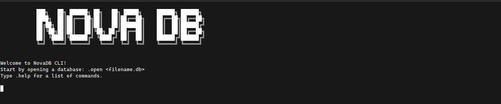
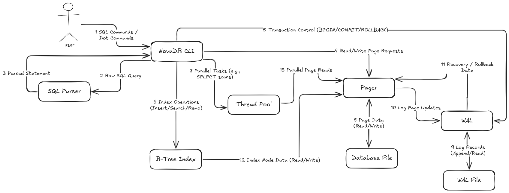

# NovaDB

## Table of Contents
*   [Introduction](#introduction)
*   [Why NovaDB?](#why-novadb)
*   [Key Features](#key-features)
*   [Architecture](#architecture)
*   [Technologies Used](#technologies-used)
*   [Installation](#installation)
*   [Usage](#usage)
*   [Testing](#testing)
*   [Future Enhancements](#future-enhancements)

## Introduction
NovaDB is a lightweight, command-line interface (CLI) based database management system designed for simplicity and efficiency. It supports a subset of SQL for data definition (DDL) and data manipulation (DML), along with basic transaction management. It aims to provide an educational yet production-grade experience in understanding how databases work from the ground up — including parsing, indexing, transaction management, and SQL execution.

## Why NovaDB?
NovaDB was created with the following objectives:
*   To build a C++-based database engine with a custom storage engine and SQL parser.
*   To support a command-line interface (CLI) for direct interaction.
*   To offer SQL compatibility for common operations (CREATE, INSERT, SELECT, UPDATE, DELETE).
*   To focus on simplicity, modularity, and performance.
*   To provide clear documentation and extensibility for learning and research purposes.

It targets:
*   Students and developers learning how databases work internally.
*   Developers building lightweight embedded systems.
*   Researchers interested in experimenting with custom query optimizations or storage models.

## Key Features
*   **CLI Interface:** Interact with the database using a familiar command-line prompt.
*   **SQL Support:** Execute `CREATE TABLE`, `INSERT`, `SELECT`, `UPDATE`, `DELETE` statements.
*   **Transaction Management:** Supports `BEGIN TRANSACTION`, `COMMIT TRANSACTION`, and `ROLLBACK TRANSACTION` for data integrity.
*   **Page-based Storage:** Data is stored and managed in fixed-size pages on disk.
*   **Write-Ahead Log (WAL):** Ensures data durability and supports transaction recovery.
*   **B-Tree Indexing:** Provides basic indexing for efficient data retrieval.
*   **Multi-threaded Query Execution:** Utilizes a thread pool for parallel processing of SELECT queries.
*   **Extensibility:** Modular design allows for future additions of indexes, foreign keys, query optimizers, and plug-in style storage engines.

## Architecture
NovaDB is designed with a modular architecture, separating concerns into distinct components for clarity and maintainability. The core components reside in the `src/core/` directory, while the user interface is handled by the `src/cli/`.




### Core Components (`src/core/`)

*   **Pager (`pager.h`, `pager.cpp`):** The lowest level of the storage engine, responsible for managing interactions with the underlying `.db` file on disk. It handles reading and writing fixed-size data pages, schema storage, and WAL integration.
*   **Parser (`parser.h`, `parser.cpp`):** Responsible for interpreting SQL statements, transforming raw SQL strings into a structured internal representation (`Statement` objects).
*   **Serializer (`serializer.h`, `serializer.cpp`):** Provides utility functions for converting in-memory data structures into a byte stream suitable for storage on disk, and vice-versa.
*   **Index (`index.h`, `index.cpp`):** Implements a B-tree data structure to facilitate efficient data retrieval, mapping primary key values to page numbers.
*   **Write-Ahead Log (WAL) (`wal.h`, `wal.cpp`):** Ensures the durability and atomicity of transactions by logging all changes before applying them to the main database file.
*   **Thread Pool (`thread_pool.h`, `thread_pool.cpp`):** Used to manage and execute tasks concurrently, primarily for parallelizing full table scans during `SELECT` operations.

### Command-Line Interface (CLI) (`src/cli/main.cpp`)
The `main.cpp` file serves as the entry point for the interactive command-line application, orchestrating the interaction between the user and the core database engine through a Read-Eval-Print Loop (REPL).

## Technologies Used
*   **Language:** C++ (core engine)
*   **SQL parser:** Custom
*   **CLI:** C++ (standard input/output based REPL)
*   **File extension:** `.db`
*   **Build system:** CMake
*   **Operating systems:** Linux, Windows

## Installation

### Prerequisites
Before you begin, ensure you have the following installed on your system:
*   **C++ Compiler:** A C++17 compatible compiler (e.g., GCC, Clang).
*   **CMake:** Version 3.10 or higher.
*   **Git:** For cloning the repository.
*   **Docker (Optional):** If you plan to use the Dockerized environment.

### Building from Source
1.  **Clone the Repository:**
    ```bash
    git clone https://github.com/akram-dris/nova-db.git
    cd nova-db
    ```
2.  **Create a Build Directory:**
    ```bash
    mkdir cmake-build-debug
    cd cmake-build-debug
    ```
3.  **Configure the Project with CMake:**
    ```bash
    cmake ..
    ```
4.  **Build the Project:**
    ```bash
    cmake --build .
    ```
5.  **Verify Installation:**
    The executable `nova_db` will be located in the `cmake-build-debug/` directory.
    ```bash
    ./nova_db
    ```

### Using Docker
1.  **Build the Docker Image:**
    ```bash
    docker build -t novadb-image .
    ```
2.  **Run the Docker Container:**
    ```bash
    docker run -it novadb-image
    ```

## Usage

### Starting the CLI
```bash
./cmake-build-debug/nova_db
```

### CLI Dot Commands
*   **`.open <filename.db>`**: Opens an existing database file or creates a new one.
*   **`.tables`**: Lists all tables in the open database.
*   **`.schema [table_name]`**: Displays the schema for a specified table or all tables.
*   **`.help`**: Displays a list of all available CLI dot commands and supported SQL commands.
*   **`.exit`**: Exits the NovaDB CLI application.

### SQL Commands

#### Data Definition Language (DDL)
*   **`CREATE TABLE <table_name> (<col1> <type1>, <col2> <type2>, ...);`**: Creates a new table. Supported types: `INT`, `TEXT`.

#### Data Manipulation Language (DML)
*   **`INSERT INTO <table_name> VALUES (<value1>, <value2>, ...);`**: Inserts a new row.
*   **`SELECT * FROM <table_name> [WHERE <condition>];`**: Retrieves all columns from the specified table with optional filtering.
*   **`UPDATE <table_name> SET <col1> = <val1>, <col2> = <val2>, ... [WHERE <condition>];`**: Modifies existing rows with optional filtering.
*   **`DELETE FROM <table_name> [WHERE <condition>];`**: Deletes rows with optional filtering.

#### Transaction Control
*   **`BEGIN TRANSACTION;`**: Starts a new transaction.
*   **`COMMIT TRANSACTION;`**: Saves all changes within the current transaction.
*   **`ROLLBACK TRANSACTION;`**: Undoes all changes within the current transaction.

### Piped Input
```bash
echo ".open my_database.db\nSELECT * FROM users;\n.exit" | ./cmake-build-debug/nova_db
```

## Testing
All test scripts are located in the `tests/` directory.
To run the entire test suite:
```bash
./tests/run_tests.sh
```
Test outputs are stored in `tests/output/`.

## Future Enhancements
*   Integrate **NovaDB with the Nova Language** as a built-in database layer.
*   Create **Nova Studio**, a lightweight GUI for managing `.db` files.
